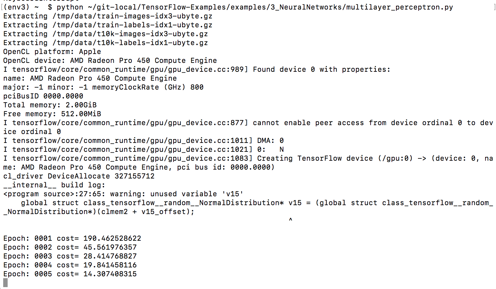

# Tensorflow-cl

Run [Tensorflow](https://github.com/tensorflow/tensorflow) on OpenCL™ 1.2 devices

- tested on Mac and Ubuntu 16.04
- should work theoretically on any OpenCL 1.2 GPU device

## What's working

- per-element unary operations
- per-element binary operations
- reductions
- BLAS, ie matrix multiplications, using Cedric Nugteren's [CLBlast](https://github.com/cnugteren/CLBlast) library
- `tf.random_normal`, `tf.random_uniform`
- trainers, including Adam

## What's missing

- `tf.split`
- Convolutions

## Piccie

On a Mac:



## Test results, [v0.17.2 wheel](https://github.com/hughperkins/tensorflow-cl/releases/tag/v0.17.2)

| test | Mac Sierra, using Radeon Pro 450 GPU (thank you [ASAPP](http://asapp.com) :-) ) | Ubuntu 16.04, using NVIDIA K520 |
|----- |-------|-------|
| unit tests (`py.test -v`) | All pass :-) | `tf.random_normal` fails. Others pass ok |
| [linear_regression.py](https://github.com/hughperkins/TensorFlow-Examples/blob/enforce-gpu/examples/2_BasicModels/linear_regression.py) |  Runs ok, loss decreases  | Runs ok, loss decreases |
| [logistic_regression.py](https://github.com/hughperkins/TensorFlow-Examples/blob/enforce-gpu/examples/2_BasicModels/logistic_regression.py) |  Runs ok, loss decreases | Runs ok, loss decreases |
| [nearest_neighbor.py](https://github.com/hughperkins/TensorFlow-Examples/blob/enforce-gpu/examples/2_BasicModels/nearest_neighbor.py) |  Ok, accuracy 0.92 | Ok, accuracy 0.92 |
| [autoencoder.py](https://github.com/hughperkins/TensorFlow-Examples/blob/enforce-gpu/examples/3_NeuralNetworks/autoencoder.py)| Runs ok, loss decreases | Runs ok, loss decreases |
| [multilayer_perceptron.py](https://github.com/hughperkins/TensorFlow-Examples/blob/enforce-gpu/examples/3_NeuralNetworks/multilayer_perceptron.py) | Runs ok, loss decreases | Runs, but probably needs `tf.random_normal` working |
| [recurrent_network.py](https://github.com/hughperkins/TensorFlow-Examples/blob/enforce-gpu/examples/3_NeuralNetworks/recurrent_network.py)| Missing split | Missing split |
| [bidirectional_rnn.py](https://github.com/hughperkins/TensorFlow-Examples/blob/enforce-gpu/examples/3_NeuralNetworks/birectional_rnn.py)| Missing split | Missing split |
| [dynamic_rnn.py](https://github.com/hughperkins/TensorFlow-Examples/blob/enforce-gpu/examples/3_NeuralNetworks/dynamic_rnn.py) | Missing split, unpack | Missing split, unpack |
| [convolutional_network.py](https://github.com/hughperkins/TensorFlow-Examples/blob/enforce-gpu/examples/3_NeuralNetworks/convolutional_network.py) | Missing conv | Missing conv |

## Installation 

- You will need:
  - the tensorflow non-gpu installation pre-requisites
  - an OpenCL 1.2-enabled GPU, and OpenCL 1.2-enabled drivers (check that `clinfo` shows your GPU, and that is shows as a GPU device)
  - python 3

For Ubuntu 16.04 and Mac Sierra, there are pre-built wheels available:

- [Mac Sierra](https://github.com/hughperkins/tensorflow-cl/releases/download/v0.17.2/tensorflow-cl-v0.17.2-macsierra-python3.zip)
- [Ubuntu 16.04](https://github.com/hughperkins/tensorflow-cl/releases/download/v0.17.2/tensorflow-cl-v0.17.2-ubuntu1604-python3.zip)

Simply download, unzip, then install using `pip`:
```
pip install --upgrade tensorflow-0.11.0rc0-py3-none-any.whl
```

For other operating systems, please [build from source](doc/build-from-source.md)

By default, Tensorflow-cl will run using the first GPU available on your system. You can use the environment variable `CL_GPUOFFSET` to choose others:

- `export CL_GPUOFFSET=1` chooses the second GPU (ie, index 1)
- `export CL_GPUOFFSET=2` chooses the third GPU

## Testing

- [testing](doc/testing.md)

## Design/architecture

- tensorflow code stays 100% [NVIDIA® CUDA™](https://www.nvidia.com/object/cuda_home_new.html)
- [Coriander](https://github.com/hughperkins/Coriander) compiles the NVIDIA® CUDA™ code into OpenCL
- Cedric Nugteren's [CLBlast](https://github.com/CNugteren/CLBlast) provides BLAS (matrix multiplications)

Presentation on [Coriander](https://github.com/hughperkins/Coriander) at this year's [IWOCL 2017](wocl.org/iwocl-2017/conference-program/)

## Enabling new operations

- [enabling operations](doc/enabling-operations.md).

## Related projects

### DNN Libraries
- [OpenCL Torch](https://github.com/hughperkins/distro-cl)
- [DeepCL](https://github.com/hughperkins/DeepCL)

## News

- May 30 2017:
  - created [v0.17.2 release](https://github.com/hughperkins/tensorflow-cl/releases/tag/v0.17.2):
    - wheels available for both Ubuntu 16.04 and Mac Sierra, for Python 3.5
    - Aymeric Damien's [autoencoder.py](https://github.com/hughperkins/TensorFlow-Examples/blob/enforce-gpu/examples/3_NeuralNetworks/autoencoder.py) and [multilayer_perceptron.py](https://github.com/hughperkins/TensorFlow-Examples/blob/enforce-gpu/examples/3_NeuralNetworks/autoencoder.py) run ok now
    - `tf.random_normal` and `tf.random_uniform` working ok on Mac/Radeon
    - Adam works now
- May 27 2017:
  - upgraded LLVM, in Coriander, from 3.8.0 to 4.0.0. Thank you to @iame6162013 for inspiring me to do this
  - tons of operations are working now, on the github version:
    - `tf.random_normal` and `tf.random_uniform` work now
    - enabled a few operations like slicing, aggregation, concat, gather
