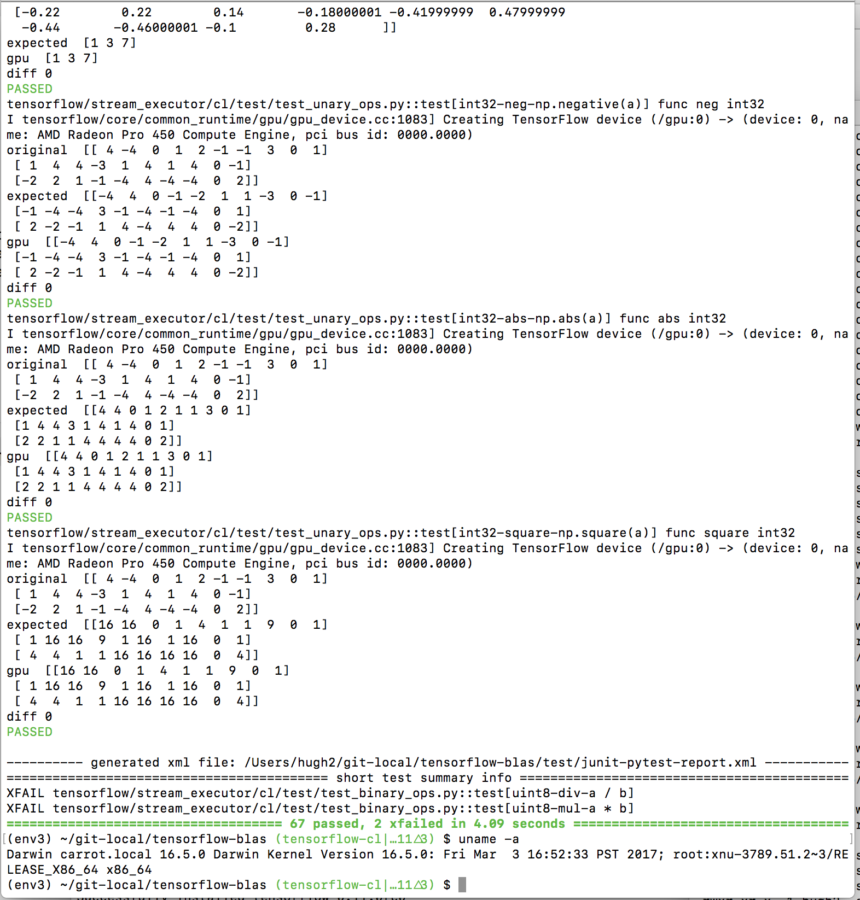

# Tensorflow-cl

Run Tensorflow on OpenCL™ 1.2 devices

## Summary

This repo was created from the original Tensorflow repository at:

- https://github.com/tensorflow/tensorflow

Please see the main repository for full Tensorflow documentation.  This readme will only focus on the OpenCL porting aspects of Tensorflow.

## Good points of this compared to other OpenCL Tensorflows

- compatible with Mac, since doesnt need SPIR ingestor
- should work theoretically on any OpenCL 1.2 GPU device, without needing SPIR 1.2 extension, or OpenCL 2.0.

## What works, what doesnt

### Things that are working:

- per-element unary operations
- per-element binary operations
- reductions
- backprop
- BLAS, ie matrix multiplications, using Cedric Nugteren's [CLBlast](https://github.com/cnugteren/CLBlast) library

### Things that arent implemented

- need a random-number generator implementation
  - ideally this would be an implementation of cuRNG, in [Coriander](https://github.com/hughperkins/Coriander), but either way, it's not implemented yet
  - should probalby be sufficient to generate random numbers on the cpu, then copy them to gpu, eg see the analysis at http://stackoverflow.com/questions/9912143/how-to-get-a-random-number-in-opencl/16130111#16130111
- need to activate cudnn within tensorflow-cl. The hard bit is mostly done, ie implementing the convolutions inside [Coriander](https://github.com/hughperkins/Coriander), but need to 'switch it on' here

## Test results, on v0.14.0 wheel

| test | Intel HD5500, beignet 1.2.1 | NVIDIA 940M, driver v367.57 |
|----- |-------|-----|
| unit tests (`py.test -v`) | pass | pass |
| [linear_regression.py](https://github.com/hughperkins/TensorFlow-Examples/blob/enforce-gpu/examples/2_BasicModels/linear_regression.py) | slow, but works   | slow, but works   |
| [logistic_regression.py](https://github.com/hughperkins/TensorFlow-Examples/blob/enforce-gpu/examples/2_BasicModels/logistic_regression.py) | ok  | ok   |
| [nearest_neighbor.py](https://github.com/hughperkins/TensorFlow-Examples/blob/enforce-gpu/examples/2_BasicModels/nearest_neighbor.py) | ok (accuracy 0.92)  | ok (accuracy 0.92)   |
| [multilayer_perceptron.py](https://github.com/hughperkins/TensorFlow-Examples/blob/enforce-gpu/examples/3_NeuralNetworks/multilayer_perceptron.py) | missing adam  | missing adam |
| [recurrent_network.py](https://github.com/hughperkins/TensorFlow-Examples/blob/enforce-gpu/examples/3_NeuralNetworks/recurrent_network.py)| missing adam   |  missing adam  |
| [autoencoder.py](https://github.com/hughperkins/TensorFlow-Examples/blob/enforce-gpu/examples/3_NeuralNetworks/autoencoder.py)|  missing rmsprop  |    |

## Test results, on v0.16.0 wheel

| test | Mac Sierra, using Radeon Pro 450 GPU |
|----- |-------|
| unit tests (`py.test -v`) | pass | pass |
| [linear_regression.py](https://github.com/hughperkins/TensorFlow-Examples/blob/enforce-gpu/examples/2_BasicModels/linear_regression.py) | slow, but works   | 
| [logistic_regression.py](https://github.com/hughperkins/TensorFlow-Examples/blob/enforce-gpu/examples/2_BasicModels/logistic_regression.py) | ok  | 
| [nearest_neighbor.py](https://github.com/hughperkins/TensorFlow-Examples/blob/enforce-gpu/examples/2_BasicModels/nearest_neighbor.py) | ok (accuracy 0.92)  |
| [multilayer_perceptron.py](https://github.com/hughperkins/TensorFlow-Examples/blob/enforce-gpu/examples/3_NeuralNetworks/multilayer_perceptron.py) | missing random number generator, and slice |
| [recurrent_network.py](https://github.com/hughperkins/TensorFlow-Examples/blob/enforce-gpu/examples/3_NeuralNetworks/recurrent_network.py)| missing Adam for matrices, missing random number generator | 
| [autoencoder.py](https://github.com/hughperkins/TensorFlow-Examples/blob/enforce-gpu/examples/3_NeuralNetworks/autoencoder.py)|  missing random number generator, and gradients for Sigmoid |  

## Installation 

The environments used for testing/development are:
- Ubuntu 16.04, with:
  - NVIDIA K80, and
- Mac Sierra, with:
  - Intel HD Graphics 530
  - Radeon Pro 450
  (using a nice Mac Book Pro 4th generation that my employer [ASAPP](http://www.asapp.com) have provided me with recently :-) )

### Ubuntu 16.04

You can install from wheel:
- You will need:
  - the tensorflow non-gpu installation pre-requisites,
   - an OpenCL 1.2-enabled GPU, and  OpenCL 1.2-enabled drivers
   - python 3
- Simply download https://github.com/hughperkins/tensorflow-cl/releases/download/v0.14.0/tensorflow-0.11.0rc0-py3-none-any.whl , and
- Install using pip:
```
pip install --upgrade tensorflow-0.11.0rc0-py3-none-any.whl
```

### Mac Sierra

For Mac Sierra, python 3.6, there is a wheel at [https://github.com/hughperkins/tensorflow-cl/releases/tag/v0.16.0](https://github.com/hughperkins/tensorflow-cl/releases/tag/v0.16.0)
- tested on Mac Sierra, using Radeon Pro 450
- to select the Radeon, given that there's probably an Intel HD530 at gpu index 0, make sure to `export CL_GPUOFFSET=1`, which will select the gpu at index 1, ie the Radeon
- you'll need to install python 3.6, and create a virtualenv from it, activate it
- download the tar file from the link just above, and install by doing:
```
tar -xf tf-v0.16-wheel-mac-sierra-py36.tar
cd tf-v0.16-wheel-mac-sierra-py36
pip install --upgrade tensorflow-0.11.0rc0-py3-none-any.whl
```

Piccie of tests running on Mac Sierra:



### Build from source

If you want, you can [build from source](doc/build-from-source.md)

## Testing


### Setup

```
pip install -r tensorflow/stream_executor/cl/test/requirements.txt
```

### Run

```
py.test -v
```

## Design/architecture

- tensorflow code stays 100% [NVIDIA® CUDA™](https://www.nvidia.com/object/cuda_home_new.html)
- [Coriander](https://github.com/hughperkins/Coriander) compiles the CUDA code into OpenCL
- Cedric Nugteren's [CLBlast](https://github.com/CNugteren/CLBlast) provides BLAS (matrix multiplications)

## Related projects

### DNN Libraries
- [OpenCL Torch](https://github.com/hughperkins/distro-cl)
- [DeepCL](https://github.com/hughperkins/DeepCL)

### OpenCL middleware
- [CLBlast](https://github.com/CNugteren/CLBlast) BLAS for OpenCL
- [Coriander](https://github.com/hughperkins/coriander)  Compile NVIDIA® CUDA™ apps for OpenCL 1.2
- [EasyCL](https://github.com/hughperkins/EasyCL)   Handles running kernels, passing in arguments etc, on OpenCL

## News

- May 10 2017:
  - test results on Mac Sierra with Radeon Pro 450, using v0.16.0 wheel, now approximately in line with earlier results on Ubuntu, using v0.14.0 wheel
    - https://github.com/hughperkins/tensorflow-cl/releases/tag/v0.16.0
- May 9 2017:
  - Mac build runs ok :-)  See the release at [Mac build and wheel](https://github.com/hughperkins/tensorflow-cl/releases/tag/v0.15.0)
  - tested on Mac Sierra, using Radeon Pro 450 GPU
- May 2017:
  - My employer [ASAPP](http://asapp.com) have given me use of a nice Mac Book Pro 4th Generation, complete with Radeon Pro 450 GPU :-)  I've started looking into getting tensorflow-cl to build/run on it. Actually, it already builds. Just some small(-ish?) teething problems with getting it to run. Watch this space, or post/subscribe into [Mac build doesnt run yet](https://github.com/hughperkins/tensorflow-cl/issues/30) issue
- Dec 3:
  - BUILT A MAC WHEEL!!!  This is entirely untested.  But the wheel is here: https://s3.amazonaws.com/hughperkinstravis/cache/tensorflow-cl/travis/tensorflowpkg.tar.gz  (Simply untar it, and `pip install` it)
    - corresponding travis log is at https://travis-ci.org/hughperkins/tensorflow-cl/builds/180917138 and https://travis-ci.org/hughperkins/tensorflow-cl/builds/180410593
    - note that I had to built this in several stages, since it's a 3 hour build, and the logs for this are at https://s3.amazonaws.com/hughperkinstravis/cache/tensorflow-cl/travis/90-c520cc1-log.txt and https://s3.amazonaws.com/hughperkinstravis/cache/tensorflow-cl/travis/91-c55079d-log.txt
    - hmmm, doesnt seem to import yet though.   https://travis-ci.org/hughperkins/tensorflow-cl#L2419
- Nov 29:
  - Mac build ran to completion!  On Travis.  Build output https://travis-ci.org/hughperkins/tensorflow-cl/builds/179727517  Yes, it didnt run, didnt create the wheel.  But the `build_pip_package` target built to completion.  which is a huge step forward :-)  Travis script here: [.travis.yml](.travis.yaml)
- Nov 25:
  - release wheel [v0.14.0](https://github.com/hughperkins/tensorflow-cl/releases/download/v0.14.0/tensorflow-0.11.0rc0-py3-none-any.whl)
    - this fixes `argmin`, `argmax`, and `softmax`
    - tons of changes under-the-hood
- Nov 10:
  - released wheel [v0.13.0](https://github.com/hughperkins/tensorflow-cl/releases/download/v0.13.0/tensorflow-0.11.0rc0-py3-none-any.whl)
     - beignet test results fairly solidly match K520 results now
     - fixed the regression on `not_equal` operator
     - removed the spam from memory copy  
- Nov 9:
  - fixed unary and binary operators on beignet
  - note that the tools/bazel.rc.templ has changed.  Please make sure to copy the new value into tools/bazel.rc, or re-run configure (probably need to do `bazel clean` anyway, so might as well do `./configure`)
